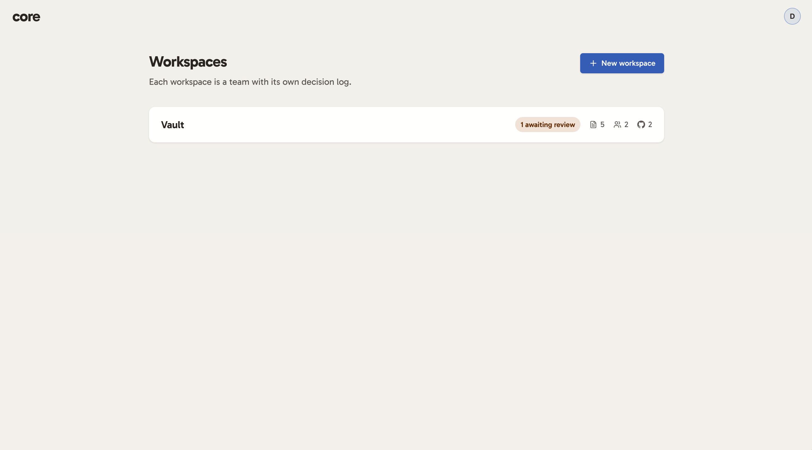
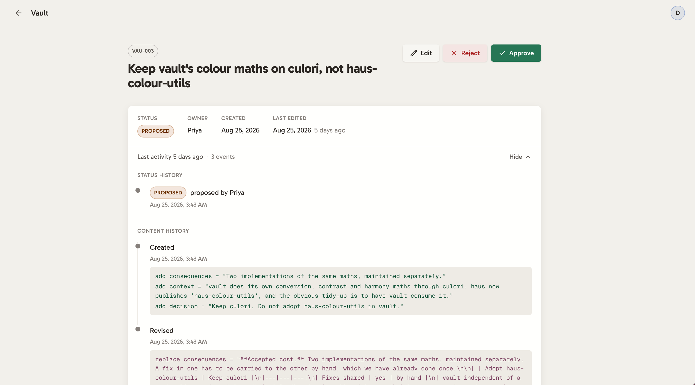
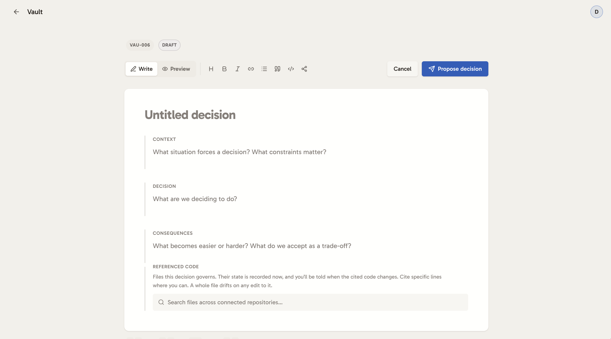
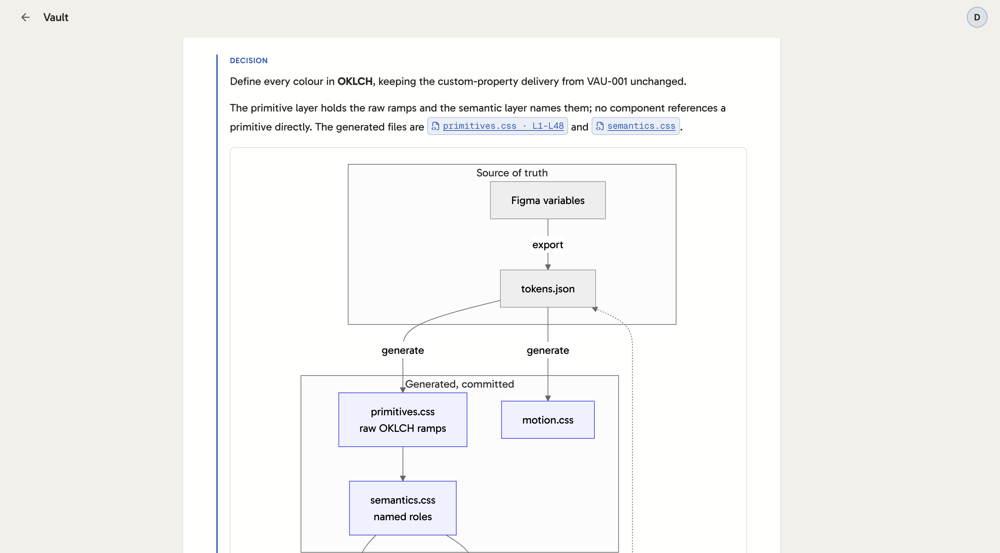
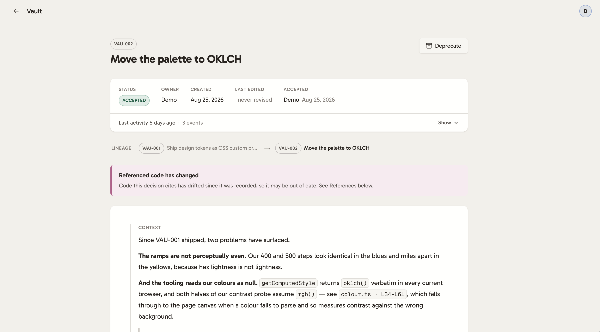
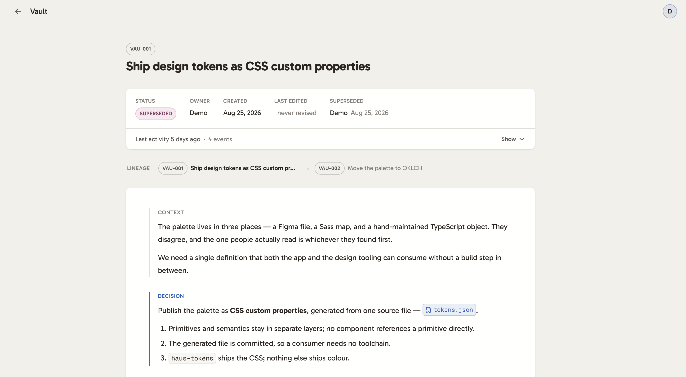
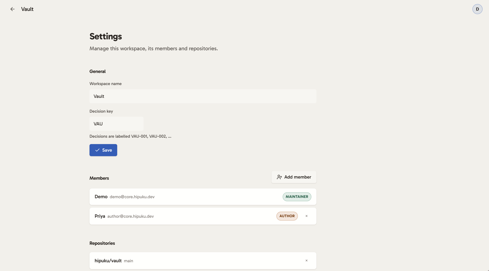

# Features

What core does, as built. The reasoning behind each choice is in
[DESIGN.md](./DESIGN.md).

---

## Workspaces



A workspace is a team with its own decision log. Each has its own membership,
its own connected repositories, and its own ADR numbering: a Jira-style key
derived from the name, so decisions read as `VAU-001`. The key is editable and
the numbers are not.

The row carries what tells you whether to open it: how many decisions await
review, and how many records, members and repositories there are.

---

## The decision log


Every decision, newest first, with its key and its status. The line under the
title states your own role, because what you can do to a record depends on it.

Statuses take poster inks that are theirs alone: an accepted decision is never
the same green as a button, and a deprecated one is never the mustard of a
warning notice.

---

## The lifecycle

A decision moves through a state machine held as a data table, and nothing moves
it except by matching a row in that table.

```
proposed ──accept──▶ accepted ──deprecate──▶ deprecated
   │                    │
 reject             supersede
   ▼                    ▼
rejected            superseded
```

`rejected`, `deprecated` and `superseded` are terminal, since no row starts from
them. Every transition is recorded with who made it, when, and optionally why.

**Accepted decisions are immutable.** Past `proposed`, the body cannot be
edited. You supersede a decision and link its replacement, so what was decided
and when cannot be quietly rewritten later.

### Roles

Two roles, defined as bundles of capabilities rather than as checks scattered
through the code:

| | propose | edit | accept | reject | deprecate | supersede |
|---|---|---|---|---|---|---|
| **author** | ✓ | ✓ | | | | |
| **maintainer** | ✓ | ✓ | ✓ | ✓ | ✓ | ✓ |

An author sees no lifecycle actions at all, and no disabled ones either. Every
guard returns a *reason* rather than a boolean, so wherever an action is shown
and refused, the interface can say why.

---

## Reviewing a proposal



A maintainer sees Edit, Reject and Approve. Approve carries its own green: it is
irreversible and audited, and it is the one action on the page that says "yes,
and permanently".

The dossier card holds the facts a reader wants before the prose: status, owner,
when it was created, when it was last edited, and who accepted it.

---

## Two audit trails

They answer different questions and are stored separately.

**Content history.** Every revision of the body, as a structural JSON diff over
RFC 6901 pointers, shown as the fields that were added or replaced. Restoring an
old version writes a *new* commit whose state equals the target rather than
rewinding the head, the way `git revert` works. History stays append-only, and
two people editing one document cannot silently erase each other.

**Status history.** An append-only log of every transition, with actor, time
and reason.

Both live behind one Activity drawer, which carries a summary when closed
("Last activity 5 days ago · 3 events") so you know whether opening it is worth
the click.

---

## Writing



### The editor is the document

No field fills, no borders, and type metrics matching the rendered prose
exactly, so a paragraph does not reflow between Write and Preview. The ADR's
three blocks are marked by a left gutter rule that takes the accent on focus.
That rule is the editor's only chrome.

None of the three is labelled optional. A decision without its context cannot be
re-argued later, which is most of why the record exists.

### It behaves like markdown while you type

A plain `<textarea>`, with the behaviour that makes one feel like an editor:

- **Enter continues a list**: bullets, ordered (`3.` becomes `4.`), task items,
  blockquotes, preserving indentation. Enter on an *empty* item ends the list.
- **Tab indents**, Shift+Tab outdents, across every line the selection touches.
- **⌘B / ⌘I / ⌘K / ⌘E** wrap, and unwrap if already wrapped.
- **⌘↵ submits** from anywhere in the document.
- A **toolbar** inserts the syntax in front of you, so it teaches the shortcut it
  stands in for.

All of that is pure text-in / text-out, tested directly rather than through the
DOM.

### What renders



Full markdown with GitHub extensions (headings, tables, task lists, blockquotes,
fenced code) plus **Mermaid diagrams** in ```mermaid fences, rendered
client-side with `securityLevel: strict`.

---

## Drafts

An unsent decision, parked by its author.

- **No ADR number.** Reserving one would leave permanent gaps in the sequence
  every time a draft was abandoned, and a gap cannot be repaired, because
  numbers are how people cite decisions.
- **Private to its author**, including from maintainers.
- **No transitions**, because nothing has happened to it yet.
- **No title required.** A missing one is derived from the first line actually
  written, preferring the Decision block, with markdown stripped.

### Nothing is lost

Three layers, doing different jobs:

1. **Local autosave** while composing, the net for a session that has never
   reached the server. Offered on return, and applied only when accepted.
2. **Save as draft**, the deliberate act of parking something, visible in the
   decisions list.
3. **A navigation guard**: leaving with unsaved work asks first, and catches
   in-app navigation as well as closing the tab, because client routing never
   touches `beforeunload`.

Cancel offers three outcomes: keep editing, discard, or park it as a draft.

---

## Code references

The part that makes a decision code-aware.

### Finding a file

One search across **every connected repository at once**. Picking a repo first
was a gate in front of the only step that mattered: an author citing a file
knows the filename far more often than they know which repo holds it.

### Citing a range

A reference may name a line span, which changes the claim from *"this file
changed"* to *"the code this decision governs changed"*. A whole-file reference
drifts on any commit touching the file, and a staleness signal that fires that
often stops being read.

### Citing inside the prose

`{{owner/repo:path#L47-L120}}` renders as a file chip linking to those exact
lines. It is inserted with a click from the reference list, and it stays plain
text on purpose: it survives being copied into a commit message or a chat
thread, which a rich-editor node would not.

### Drift



Citing a file records its blob SHA, and where a range was given, the cited text
itself.

**The baseline moves when the decision is accepted.** A citation made while
drafting records the code the *author* was looking at, and the decision does not
exist until the team accepts it. Without this, a proposal that sat in review for
a fortnight is flagged as drifted the instant it is agreed.

**Movement is not change.** Insert twenty lines above a cited block and it is
untouched but now lives elsewhere. The stored text is searched for before
anything is called drift, and a block found intact has its range updated to
follow it. Trailing whitespace is normalised away, so a formatter run is not
drift; changed indentation *is*, because the block changed scope.

Three outcomes, **in sync**, **changed** and **missing**, reported on the
document where you would decide whether to act. They are not reported while
writing, where a file cited moments ago can only be in sync.

---

## Supersession and lineage



Changing an accepted decision means writing a new one and linking the two. The
lineage row shows the whole chain the record sits in rather than the next hop,
so a decision three revisions deep can be read as the latest word in a
conversation.

---

## Settings



Maintainers manage the workspace, its members and its repositories from one
page. The decision key is editable here, with the labels it produces shown
underneath.

Numbers are assigned inside the same transaction that creates the decision, and
a unique constraint on the workspace and number holds the guarantee that
`max + 1` cannot make on its own. Two simultaneous proposals cannot take the
same number.

---

## The public demo

[core.hipuku.dev](https://core.hipuku.dev) runs the same code with three
deployment flags set.

**No sign-up.** The page does not exist. An invite code is a shared secret
rather than access control, since whoever holds it can pass it on.

**One read-only account**, credentials on the sign-in page. It may write and
save drafts, and it may not change the decision log. A draft is private and
holds no number, so the worst a visitor leaves behind is unfinished text.
Accepting a seeded decision would change what the next visitor sees.

**No GitHub linking.** The app requests the `repo` scope, which is read *and
write* on private repositories, and a public deployment holding a stranger's
token with that reach is not a risk worth taking for a demo. File browsing still
works, through a read-only public-repositories token belonging to the
deployment, which is safe to hold where a user's would not be.

Running it locally has none of these restrictions. See the
[README](./README.md).

---

## Deliberately not built

- **Real-time collaborative editing.** ADRs are drafted by one person and
  reviewed by others. CRDT co-editing would be an impressive answer to a
  question this domain does not ask.
- **A `draft` lifecycle status.** Drafts are their own table, for the reasons
  above.
- **Adding link references from the UI.** Composing never had it, and unifying
  the reference field on the file flow meant dropping it. A markdown link in the
  prose covers the need.
- **Auto-tracking files cited inline.** Citing a file in prose does not start
  watching it for drift. "Mentioned in an argument" and "this decision governs
  this code" are different claims, and conflating them would fill the log with
  drift from files cited as counter-examples.
