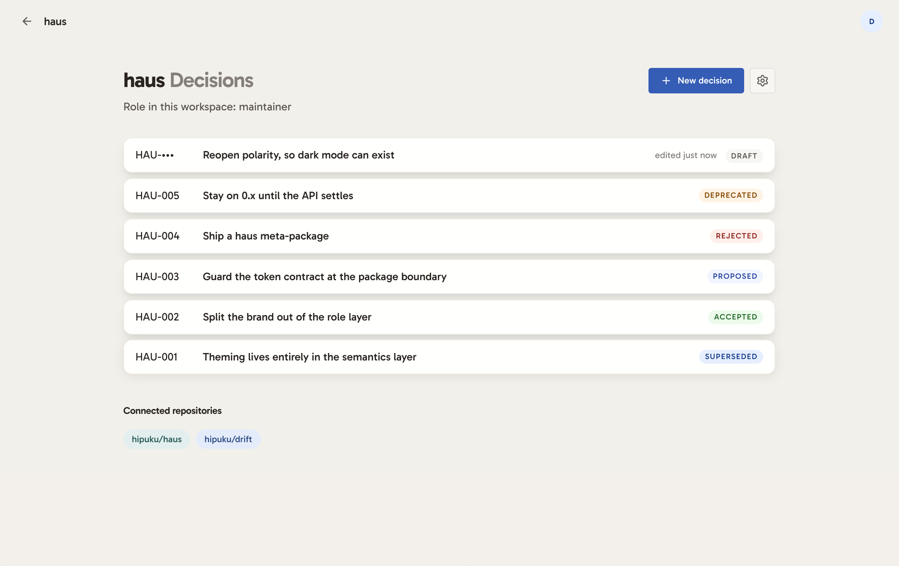

# core

A team decision log: architecture decision records with a lifecycle,
permissions, two audit trails, and a link to the code they govern, so a decision
can tell you when the thing it decided has changed underneath it. Next.js and
React over Postgres.

**[core.hipuku.dev](https://core.hipuku.dev)** is a read-only demo, with
credentials on the sign-in page.



Notion holds the document but not the governance. Jira holds the workflow and is
not a document. core is a governed document that knows about the code it
decided.

## Features

- **Propose, accept, deprecate or supersede**, as a state machine with
  permission-gated transitions. Accepted records are immutable, and you supersede
  them to change one.
- **Two audit trails.** Content revisions live in a versioning engine; status
  transitions live in their own append-only log. How the text changed and how the
  decision moved are different questions, and are stored as such.
- **Markdown and Mermaid** in the body, with inline file citations.
  `{{owner/repo:path#L47-L120}}` renders as a link to the exact lines.
- **Staleness detection.** Citing a file records the code as it stands, the
  baseline moves to what the team agreed when the decision is accepted, and a
  drift check reports whether the cited code has changed since. A citation can
  name a line range, so drift means the cited lines changed.
- **Drafts.** Unsent decisions, private to their author, holding no ADR number.

The full walkthrough is in [FEATURE.md](./FEATURE.md).

## Install

```bash
cp .env.example .env.local   # fill in DATABASE_URL and BETTER_AUTH_SECRET
npm install
npm run db:push              # create the tables
npm run dev
```

A free [Neon](https://neon.tech) or Supabase Postgres works for local
development. Generate the auth secret with `openssl rand -base64 32`.

Nothing else is needed. No Redis, no queue, no third-party service. Node,
Postgres and a browser.

## Develop

**Seed some data.** An empty decision log demonstrates nothing:

```bash
npm run db:seed
```

That builds a workspace with five decisions covering the whole lifecycle:
accepted, superseded, proposed and awaiting review, rejected, deprecated. Plus a
revision, markdown and Mermaid, a parked draft, seven references and one that has
already drifted.

It is idempotent by workspace name: re-running replaces what it created and
touches nothing else.

**GitHub is optional.** Without `GITHUB_CLIENT_ID` and `GITHUB_CLIENT_SECRET`,
everything works except connecting a repository and citing files from it. Sign up
with email and password and the rest of the product is there. To enable it,
register an OAuth app at github.com/settings/developers with the callback
`<BETTER_AUTH_URL>/api/auth/callback/github`, and set `BETTER_AUTH_URL` to
whatever port you are actually running on.

**To see it as the public demo does.** The deployment closes sign-up and signs
everyone into one seeded account that may write drafts but may not change the
decision log. To reproduce that locally, add to `.env.local`:

```bash
DISABLE_SIGNUP=1                              # /sign-up 404s, its link disappears
DEMO_USER_EMAIL=demo@core.hipuku.dev          # the account db:seed creates
DEMO_USER_PASSWORD=read-only-demo-2026
DISABLE_GITHUB=1                              # optional: hides Connect GitHub
```


**Before committing:**

```bash
npm run lint && npm run typecheck && npm test
npm test -- --project=domain     # just the fast ones
npm test -- --project=ui
```

Two vitest projects, because the suites have different needs. `domain` runs in
Node: every pure module has its own suite, exercised directly rather than through
a component. `ui` runs in jsdom and covers what is only observable in a browser,
which is draft autosave and recovery, the unsaved-navigation guard, and the
compose editor's markdown keystrokes reaching the caret.

The domain suite runs against the in-memory store, so what it proves about the
permission model, which is the product, it proves about a double. Two suites
close that gap and they close different halves of it.

`store-parity.test.ts` is **structural**. It holds `MemoryDecisionStore` and
`DrizzleDecisionStore` to the same method set, so a port method added to one and
forgotten on the other fails here rather than on a page. It is worth having
because that failure is otherwise silent: TypeScript checks each class against
the interface, so a method dropped from the interface and from both classes
typechecks cleanly while the service still calls it. It catches nothing about
behaviour.

`store-contract.test.ts` is **behavioural**, and it is the one that matters.
**43 cases, each run twice against the same assertions, once per store**, so a
difference between the double and the real thing is a failure rather than a
surprise in production: an ordering that only holds because a `Map` preserves
insertion order, a null the SQL side stores differently, a count that includes a
row the other excludes.

It runs against **a real Postgres, with nothing installed**. PGlite is Postgres
compiled to WebAssembly and run in this process, so the planner, the types and
the constraint and transaction semantics are Postgres's rather than an
emulator's. No Docker, no service container, no `DATABASE_URL`: `npm test` runs
it on a laptop and in CI identically. The DDL is generated from the Drizzle
schema rather than from a checked-in dump, so a column added to `lib/db/schema`
is present on the next run and cannot drift out of step with the tables the
tests write to.

See [DESIGN.md](./DESIGN.md) for what the pair still does not prove.

CI runs lint, typecheck and test on every push and pull request, then a
production build once they agree. Each check reports independently, so one run
tells you everything that is wrong rather than only the first thing.

## Scripts

| Script              | What it does                            |
| ------------------- | --------------------------------------- |
| `npm run dev`       | Next dev server                         |
| `npm run build`     | Production build                        |
| `npm run lint`      | eslint                                  |
| `npm run typecheck` | `tsc --noEmit`                          |
| `npm test`          | Vitest, the domain and ui suites        |
| `npm run db:push`   | Push the Drizzle schema to the database |
| `npm run db:seed`   | Populate a workspace worth looking at   |
| `npm run db:studio` | Drizzle Studio                          |

## More

[FEATURE.md](./FEATURE.md) walks through what the product does.
[DESIGN.md](./DESIGN.md) covers the architecture, the storage port, why restore
is a forward action, why a draft is not a status, and what is deliberately left
out.

## Stack

Next.js (App Router) · React · TypeScript · Postgres · Drizzle ORM ·
better-auth · haus · Vitest. No Tailwind: CSS modules over the haus design
system (`haus-tokens` under core's own brand, `haus-components` for the
controls), with core's domain components on top. See [DESIGN.md](./DESIGN.md)
for what it takes and what it keeps.
